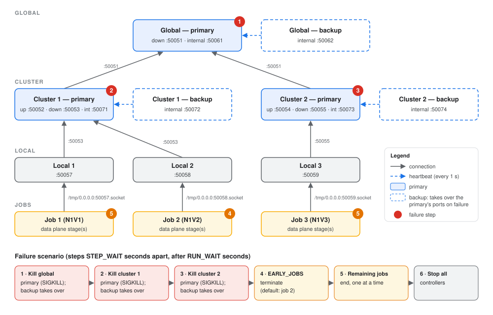

# SHIO: Scalable and Holistic HPC I/O Management

This repository contains the artifact of the paper **"A Tale of Scale: Enabling Scalable and Holistic Storage QoS for Exascale HPC Systems"** (Middleware '26).

## 📖 Introduction to SHIO

**Overview:**
SHIO is a hierarchical Software-Defined Storage (SDS) control plane that enforces system-wide storage Quality of Service (QoS) for jobs running on large-scale HPC systems. Data plane stages, deployed on each compute node, intercept and rate-limit the I/O requests that jobs submit to the shared Parallel File System (PFS). The control plane collects I/O metrics from these stages, computes storage rules, and enforces them, so that policies such as a maximum aggregate PFS throughput, fair sharing, or job priorities hold across the whole infrastructure.

Unlike state-of-the-art centralized and hierarchical designs, SHIO delegates control logic across all levels of its hierarchy:
- **Cluster controllers** manage a subset of compute nodes and independently compute and enforce rules for the jobs whose stages fall entirely under them (*governor*). For jobs spanning several cluster controllers, they aggregate metrics and forward rules on behalf of the global controller (*relay*).
- **The global controller** distributes resource shares among all controllers (*orchestrator*) and directly manages distributed jobs that span multiple cluster controllers (*governor*).
- **Prosha**, a proportional demand-aware hierarchical resource-sharing algorithm, lets the orchestrator distribute resources among controllers based on their aggregated demand and usage, so that each governor can run PSFA for its own jobs without centralizing global state.
- **Dependability**: every global and cluster controller can be paired with a hot-swap backup that monitors it through heartbeats, takes over its network addresses on failure, and rebuilds its state through a collection step.

In the paper, SHIO coordinates up to 100,000 data plane stages on 2,000 compute nodes of the Frontera supercomputer, reducing control cycle latency from ≈1 second (state-of-the-art hierarchical designs) to ≈55 ms.

This artifact is organized with the following contributions:
- SHIO's control plane (global, cluster, and local controllers, with primary-backup fault tolerance);
- A synthetic data plane stage, used for stress-testing the control plane at scale (*Configuration B* in the paper);
- A realistic data plane built on [PAIO](https://github.com/dsrhaslab/paio) and [PADLL](https://github.com/dsrhaslab/padll), plus a trace replayer and the I/O traces of GROMACS, OpenFOAM, ResNet-50, and ShuffleNet (*Configuration A*);
- Scripts to run SHIO locally and to reproduce the experiments on the Frontera supercomputer.

```
                              Global Controller
                      (orchestrator + governor [+ backup])
                         /                          \
          Cluster Controller                  Cluster Controller
       (governor + relay [+ backup])       (governor + relay [+ backup])
            /            \                           |
   Local Controller   Local Controller        Local Controller
          |                  |                       |
  Data Plane Stage(s)  Data Plane Stage(s)   Data Plane Stage(s)
     (compute node)      (compute node)         (compute node)
```

## 🖥️ Hardware and OS specifications of the reported experiments

The experiments in the paper were conducted on compute nodes of the [Frontera](https://tacc.utexas.edu/systems/frontera/) supercomputer, each with the following configuration:
- **CPU:** 2× 28-core Intel Xeon processors
- **Memory:** 192 GiB RAM
- **Storage:** 240 GiB SSD
- **Network:** Mellanox InfiniBand HDR-100
- **Operating System:** CentOS 7.9, with Linux kernel 3.10

To emulate systems of 10,000 to 100,000 nodes, each physical compute node hosts 50 data plane stages (*e.g.,* 100,000 stages run on 2,000 physical nodes). Controllers run on dedicated compute nodes.

💡 **Note:** SHIO is not tied to any specific hardware. The control plane and the data plane can run on a single commodity machine (for example, with the Docker image below), although results at that scale will differ from those reported in the paper.

---

## Steps to download, install, and test SHIO

#### Clone the SHIO repository

```bash
git clone git@github.com:dsrhaslab/shio.git
# or
git clone https://github.com/dsrhaslab/shio.git

cd shio
```

#### 📦 Build the Docker image

The Docker image installs all build dependencies and compiles:
- the control plane (`control_plane/build/shio_exec`);
- the synthetic data plane stage (`data_plane/synthetic_dp/build/data_plane_stage`);
- PAIO and PADLL (`data_plane/realistic_dp/paio_padll_dp/{paio,padll}/build`);
- the trace replayer (`data_plane/realistic_dp/trace_replayer/trace_replayer`), and extracts the collected traces.

gRPC (v1.67.0), gflags, spdlog, and yaml-cpp are downloaded and built by CMake during the build.

> ⚠️ Building gRPC takes a while (up to an hour, depending on the hardware).

```bash
docker build -t shio .
```

#### 🚀 Running SHIO locally

Start an interactive container. We recommend mounting the `results` directory as a volume, so that the logs of each run remain available after the container stops.

```bash
# while in the root of the repository
docker run -it --rm -v ./results:/shio/results shio:latest /bin/bash
```

Inside the container, three scripts launch a full controller hierarchy on the local machine: one global controller, two cluster controllers, three local controllers, and one job (with its data plane stages) per local controller.

Jobs can use either data plane:
- **synthetic** (default): the synthetic data plane stage, which reports randomly generated I/O metrics (*Configuration B* in the paper);
- **real**: the trace replayer, with PADLL intercepting its I/O and enforcing the control plane's rules. Each job replays the collected I/O traces of an HPC application (GROMACS, ResNet, OpenFOAM, or ShuffleNet) (*Configuration A*).

**Hierarchy with backup controllers and failure injection:**

```bash
cd /shio
./local_scripts/launch_hierarchy.sh
```

The global and cluster controllers run as primary-backup pairs. Each backup sends heartbeats to its primary every second and, when the primary fails, takes over its network addresses. After the hierarchy has run for `RUN_WAIT` seconds, the script:
1. kills each primary controller in sequence (global, then each cluster controller), so that its backup takes over;
2. terminates some jobs (`EARLY_JOBS`);
3. ends the remaining jobs one at a time;
4. stops all controllers.

<p align="center">  </p>

**Hierarchy without backup controllers:**

```bash
cd /shio
./local_scripts/launch_hierarchy_no_backup.sh
```

Each global and cluster controller runs alone, and the hierarchy keeps running until `Ctrl-C`.

**Hierarchy with the real data plane:**

```bash
cd /shio
./local_scripts/launch_hierarchy_real_dp.sh
```

Each global and cluster controller runs alone, and each job replays the trace of an application (by default, GROMACS, ResNet, and OpenFOAM) for `JOB_DURATION` seconds. When all jobs finish, the controllers are stopped. The real data plane can also be used with the other two scripts by setting `DATA_PLANE=real` (*e.g.,* `DATA_PLANE=real ./local_scripts/launch_hierarchy.sh`).

> ⚠️ PADLL intercepts I/O through `LD_PRELOAD` and requires Linux, so run the real data plane inside the container. The trace replayer issues real I/O to `/tmp/replay_files`, which grows with the duration of the run.

The scripts accept the following environment variables:

| Variable | Description | Default |
|---|---|---|
| `DATA_PLANE` | data plane used by the jobs: `synthetic` or `real` | `synthetic` (`real` for `launch_hierarchy_real_dp.sh`) |
| `STAGES_PER_JOB` | data plane stages launched per job | `1` |
| `DATA_PLANE_BIN` | synthetic data plane stage binary | `data_plane/synthetic_dp/build/data_plane_stage` |
| `JOB_APPS` | application replayed by each job (real data plane): `gromacs`, `resnet`, `openfoam`, or `shufflenet` | `gromacs resnet openfoam` |
| `JOB_DURATION` | seconds each job replays its trace (real data plane) | `60` |
| `PADLL_LIB`, `PAIO_LIB_DIR`, `TRACE_REPLAYER`, `TRACES_DIR` | real data plane binaries and traces | paths built by the Docker image |
| `JOB_CMD` | custom command that starts a job, instead of a data plane | — |
| `RESULTS_DIR` | base directory for the results | `results` |
| `STARTUP_WAIT` | seconds between launch steps | `2` |
| `RUN_WAIT` | seconds before the first failure (`launch_hierarchy.sh` only) | `20` |
| `STEP_WAIT` | seconds between failure/termination steps (`launch_hierarchy.sh` only) | `10` |
| `EARLY_JOBS` | jobs terminated early (`launch_hierarchy.sh` only) | `2` |

For example, for a shorter failure scenario with 5 stages per job:

```bash
RUN_WAIT=10 STEP_WAIT=5 STAGES_PER_JOB=5 ./local_scripts/launch_hierarchy.sh
```

Or, for 2 minutes of ShuffleNet and GROMACS traces through PADLL:

```bash
JOB_APPS="shufflenet gromacs" JOB_DURATION=120 ./local_scripts/launch_hierarchy_real_dp.sh
```

📈 **Output:**

Each run writes its logs (one file per controller and per stage) and the generated controller configuration files to `results/<timestamp>/`.

***

#### 🧪 Running the experiments on Frontera

The scripts used for the paper's experiments are in `frontera_scripts/`. They are submitted through Slurm and launch controllers and stages across nodes with `ibrun`. The `test_*nodes.sh` scripts are the entry points, each targeting a different system size:

```bash
cd frontera_scripts

sbatch test_50_nodes.sh     # 50 stages
sbatch test_400nodes.sh     # 400 stages
sbatch test_2500nodes.sh    # 2,500 stages
sbatch test_10000nodes.sh   # 10,000 stages
```

Each entry point calls the matching `shared/call_multiple_op2_*.sh` script, which sets the experiment's topology (cluster controllers, physical nodes, stages per node). It then runs `shared/test_distributed_multi_deallocate_with_jobs_config_file.sh`, which deploys the global, cluster, and local controllers and the data plane stages, replaying the collected traces through PADLL. CPU, memory, and network usage are collected with [Remora](https://github.com/TACC/remora).

The controller setup is selected by the third argument of `call_multiple_op2_*.sh`:
- `dependability_testing` (default): primary + backup global and cluster controllers, with failure injection (`frontera_scripts/dependability_testing/`), as in §4.3 of the paper;
- `normal_testing`: single global and cluster controllers (`frontera_scripts/normal_testing/`).

```bash
./shared/call_multiple_op2_400_try_50_per_node_all.sh test_name "10000nodes_50_100_50_100_50" normal_testing
```

The jobs deployed in each run (*Configuration A*, workload A1) are defined in `frontera_scripts/jobs_config_files/`, and the controller and policy configuration files in `frontera_scripts/files/`. Scripts to process the outputs are in `frontera_scripts/processing_scripts/`.

> ⚠️ These scripts assume Frontera's environment (Slurm, `ibrun`, Remora, and the `$WORK`/`$SCRATCH` file systems) and a copy of this directory and of the compiled binaries under `$WORK`. Adjust the paths at the top of `shared/test_distributed_multi_deallocate_with_jobs_config_file.sh` to your environment.

---

## 📂 Repository structure

```
shio/
├── control_plane/           # SHIO controllers (C++, gRPC)
│   ├── src/, include/       #   controllers, control applications, networking
│   ├── protos/              #   gRPC interface between controllers
│   └── files/               #   example controller, policy, and job configuration files
├── data_plane/
│   ├── synthetic_dp/        # synthetic data plane stage (Configuration B)
│   └── realistic_dp/
│       ├── paio_padll_dp/   # PAIO and PADLL (Configuration A)
│       └── trace_replayer/  # trace replayer and collected I/O traces
├── local_scripts/           # launch a controller hierarchy on a single machine
├── .docs/                   # figures used in this README
├── frontera_scripts/        # experiment scripts for the Frontera supercomputer
└── Dockerfile
```

## 📄 License

SHIO is distributed under the BSD 3-Clause License. See [LICENSE](LICENSE) for details. PAIO and PADLL are distributed under their own licenses, in their respective directories.

## 📝 Citation

If you use SHIO in your work, please cite our paper:

```bibtex
@inproceedings{miranda2026shio,
  title     = {A Tale of Scale: Enabling Scalable and Holistic Storage QoS for Exascale HPC Systems},
  author    = {Miranda, Mariana and Tanimura, Yusuke and Haga, Jason and Ruhela, Amit and Harrell, Stephen Lien and Cazes, John and Pereira, Jos{\'e} and Macedo, Ricardo and Paulo, Jo{\~a}o},
  booktitle = {Middleware '26},
  year      = {2026}
}
```

## 🙏 Acknowledgments

This work is funded by national funds through FCT – Fundação para a Ciência e a Tecnologia, I.P., under the support UID/50014/2025 ([https://doi.org/10.54499/UID/50014/2025](https://doi.org/10.54499/UID/50014/2025)), and it has been carried out within the scope of the projects BCD.S+M, reference 14436 (NORTE2030-FEDER-00584600), CDMS, reference 17409 (COMPETE2030-FEDER-01193000), and the WISE Extra Exploratory Research Project (UTA18-001217;2024.14682.UTA) from the UT Austin Portugal Program. We thank the Texas Advanced Computing Center (TACC) for access to the Frontera supercomputer.

## 📬 Contact

For questions, please contact [Mariana Miranda](mailto:mariana.m.miranda@inesctec.pt).
