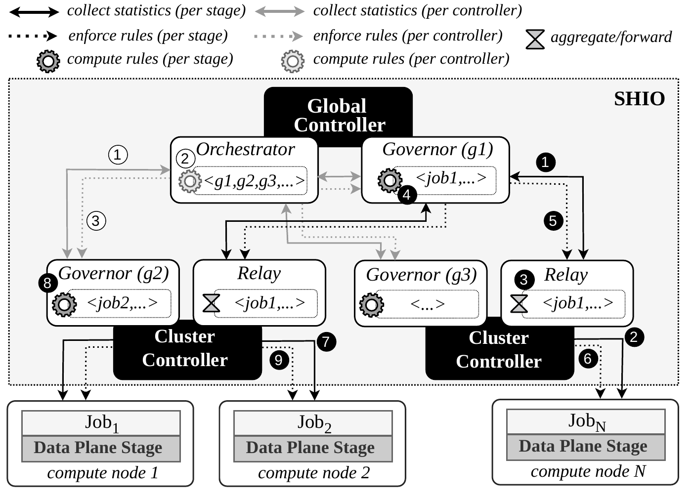

# SHIO: Scalable and Holistic HPC I/O Management

This repository contains the artifact of the paper **"A Tale of Scale: Enabling Scalable and Holistic Storage QoS for Exascale HPC Systems"** (Middleware '26) (#282). 

## 📖 Introduction to SHIO

**Overview:**
SHIO is a Software-Defined Storage (SDS) control plane that enforces storage Quality of Service (QoS) across all jobs of large-scale HPC systems. Data plane stages on each compute node intercept and rate-limit the I/O that jobs submit to the shared file system, following rules computed by a hierarchy of controllers:
- **Cluster controllers** each manage a group of compute nodes and control their jobs independently;
- **The global controller** distributes resources among the cluster controllers and coordinates jobs that span several of them;
- **Backup controllers** can take over the global or a cluster controller when it fails.

<p align="center">  </p>


In the paper, SHIO coordinates up to 100,000 data plane stages, reducing control latency from ≈1 s to ≈55 ms.

This artifact includes SHIO's control plane, a synthetic and a real ([PADLL](https://github.com/dsrhaslab/padll)-based) data plane with I/O traces of HPC applications, and scripts to run SHIO locally and on the Frontera supercomputer.


## 📂 Repository structure

```
shio/
├── control_plane/           # SHIO controllers (C++, gRPC)
│   ├── src/, include/       #   controllers, control applications, networking
│   ├── protos/              #   gRPC interface between controllers
│   └── files/               #   example controller, policy, and job configuration files
├── data_plane/
│   ├── synthetic_dp/        # synthetic data plane stage
│   └── realistic_dp/
│       ├── paio_padll_dp/   # PAIO and PADLL
│       └── trace_replayer/  # trace replayer and collected I/O traces
├── local_scripts/           # launch a controller hierarchy on a single machine
├── .docs/                   # figures used in this README
├── frontera_scripts/        # experiment scripts for the Frontera supercomputer
└── Dockerfile
```

## 🖥️ Hardware and OS specifications of the reported experiments

The experiments in the paper were conducted on compute nodes of the [Frontera](https://tacc.utexas.edu/systems/frontera/) supercomputer, each with the following configuration:
- **CPU:** 2× 28-core Intel Xeon processors
- **Memory:** 192 GiB RAM
- **Storage:** 240 GiB SSD
- **Network:** Mellanox InfiniBand HDR-100
- **Operating System:** CentOS 7.9, with Linux kernel 3.10

To emulate systems of 10,000 to 100,000 nodes, each physical compute node hosts 50 data plane stages (*e.g.,* 100,000 stages run on 2,000 physical nodes). Controllers run on dedicated compute nodes.

💡 **Note:** SHIO is not tied to any specific hardware. The control plane and the data plane can run on a single commodity machine (for example, with the Docker image below), although results at that scale will differ from those reported in the paper.

---

## Steps to download, install, and test SHIO locally

#### Clone the SHIO repository

```bash
git clone git@github.com:dsrhaslab/shio.git
# or
git clone https://github.com/dsrhaslab/shio.git

cd shio
```

#### 📦 Build the Docker image

The Docker image installs all build dependencies and compiles:
- the control plane (`control_plane/build/shio_exec`);
- the synthetic data plane stage (`data_plane/synthetic_dp/build/data_plane_stage`);
- PAIO and PADLL (`data_plane/realistic_dp/paio_padll_dp/{paio,padll}/build`);
- the trace replayer (`data_plane/realistic_dp/trace_replayer/trace_replayer`), and extracts the collected traces.

gRPC (v1.67.0), gflags, spdlog, and yaml-cpp are downloaded and built by CMake during the build.

> ⚠️ Building gRPC takes a while (up to an hour, depending on the hardware).

```bash
docker build -t shio .
```

#### 🚀 Running SHIO locally

Start an interactive container. We recommend mounting the `results` directory as a volume, so that the logs of each run remain available after the container stops.

```bash
# while in the root of the repository
docker run -it --rm -v ./results:/shio/results shio:latest /bin/bash
```

Inside the container, three scripts launch a full controller hierarchy on the local machine: one global controller, two cluster controllers, three local controllers, and one job (with its data plane stages) per local controller.

Jobs can use either data plane:
- **synthetic** (default): the synthetic data plane stage, which does not report real I/O metrics;
- **realistic**: the trace replayer, with PADLL intercepting its I/O and enforcing the control plane's rules. Each job replays the collected I/O traces of an HPC application (GROMACS, ResNet, OpenFOAM, or ShuffleNet).

**Hierarchy without backup controllers:**

```bash
cd /shio
./local_scripts/launch_hierarchy_no_backup.sh
```

Each global and cluster controller runs alone, and the hierarchy keeps running until `Ctrl-C`.

**Hierarchy with the realistic data plane:**

```bash
cd /shio
./local_scripts/launch_hierarchy_real_dp.sh
```

Each global and cluster controller runs alone, and each job replays the trace of an application (by default, GROMACS, ResNet, and OpenFOAM) for `JOB_DURATION` seconds. When all jobs finish, the controllers are stopped. The real data plane can also be used with the other two scripts by setting `DATA_PLANE=real` (*e.g.,* `DATA_PLANE=real ./local_scripts/launch_hierarchy.sh`).

> ⚠️ PADLL intercepts I/O through `LD_PRELOAD` and requires Linux, so run the realistic data plane inside the container. 

The scripts accept environment variables to change, for example, the number of stages per job, the applications replayed, or the timing of the failure scenario. See [`local_scripts/`](local_scripts/README.md) for the full list and examples.

**Hierarchy with backup controllers and failure injection:**

```bash
cd /shio
./local_scripts/launch_hierarchy.sh
```

The global and cluster controllers run as primary-backup pairs. Each backup sends heartbeats to its primary every second and, when the primary fails, takes over its network addresses. After the hierarchy has run for `RUN_WAIT` seconds, the script:
1. kills each primary controller in sequence (global, then each cluster controller), so that its backup takes over;
2. terminates some jobs (`EARLY_JOBS`);
3. ends the remaining jobs one at a time;
4. terminates.

<p align="center">  </p>

📈 **Output:**

Each run writes its logs (one file per controller and per stage) and the generated controller configuration files to `results/<timestamp>/`.

***

#### 🧪 Running the experiments on Frontera

The scripts used for the paper's experiments on the Frontera supercomputer, and the instructions to run them, are in [`frontera_scripts/`](frontera_scripts/README.md).

---

## 📄 License

SHIO is distributed under the BSD 3-Clause License. See [LICENSE](LICENSE) for details. PAIO and PADLL are distributed under their own licenses, in their respective directories.

## 📝 Citation

If you use SHIO in your work, please cite our paper:
_filling later when available_

## 🙏 Acknowledgments

This work is funded by national funds through FCT – Fundação para a Ciência e a Tecnologia, I.P., under the support UID/50014/2025 ([https://doi.org/10.54499/UID/50014/2025](https://doi.org/10.54499/UID/50014/2025)), and it has been carried out within the scope of the projects BCD.S+M, reference 14436 (NORTE2030-FEDER-00584600), CDMS, reference 17409 (COMPETE2030-FEDER-01193000), and the WISE Extra Exploratory Research Project (UTA18-001217;2024.14682.UTA) from the UT Austin Portugal Program. We thank the Texas Advanced Computing Center (TACC) for access to the Frontera supercomputer.

## 📬 Contact

For questions, please contact [Mariana Miranda](mailto:mariana.m.miranda@inesctec.pt), [João Paulo](mailto:joao.t.paulo@inesctec.pt) and/or [Ricardo Macedo](mailto:ricardo.g.macedo@inesctec.pt).
